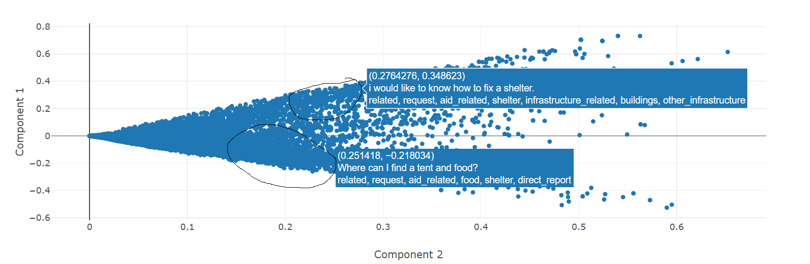

# Disaster Response Pipeline

### ML for categorizing messages during a disaster

This is a webapp which can automatically categorize text messages according to their relationship to a disaster that is happening. It also provides some summary information about the types of messages which are sent as a disaster is happening. This code has been developed as part of the "Data Scientist Nanodegree Program" with Udacity. Data have been provided to Udacity from [Appen](https://www.figure-eight.com/).

## Motivation
[Appen](https://www.figure-eight.com/) has provided Udacity users with a dataset of around 26000 pre-labeled text messages which have been sent during a natural disaster. There are 36 possible labels for each message. We would like to use these data for two primary purposes:

1. Create a classification model which can automatically label a new text message with one or more labels explaining its relevance to the disaster at hand. Such an application could be used alongside message metadata (such as location and sender identity) to quickly dispatch emergency services where they are needed.

2. Explore the provided data to better understand the services that are needed during an emergency. This includes learning what types of services coincide with other types. For example, are requests for fresh water frequently made alongside requests for medical attention?

## Setup
1. Clone this repo, then set up a virtual environment in the project root:

    ```cmd
    \\\Disaster_Response_App> python -m venv venv
    ```

2. Activate the virtual environment and install requirements with pip:

    ```cmd
    (venv) \\\Disaster_Response_App> python -m pip install -r requirements.txt
    ```

3. When running for the first time, you will need to set up your database and build your model:

    ```cmd
    (venv) \\\Disaster_Response_App> cd disaster-response-pipeline-project
    (venv) \\\Disaster_Response_App\disaster-response-pipeline-project> python data/process_data.py data/disaster_messages.csv data/disaster_categories.csv data/DisasterResponse.db
    (venv) \\\Disaster_Response_App\disaster-response-pipeline-project> python models/train_classifier.py data/DisasterResponse.db models/classifier.pkl
    ```

4. To run the webapp locally, run the following:
    ```cmd
    (venv) \\\Disaster_Response_App> cd disaster-response-pipeline-project\app
    (venv) \\\Disaster_Response_App\disaster-response-pipeline-project\app> python run.py
    ```

5. On windows, navigate to the links provided in the cmd window to view the webapp.

## Repo contents
The notebooks directory contains ipython notebooks that were used to explore the data provided by Appen and to develop processes for cleaning the data and modeling a classifier based on it.

The directory "disaster-response-pipeline-project" contains a flask app which runs the "Disaster Response Project" webapp. Raw data for this project is included in the "disaster-response-pipeline-project\data" directory as csv files. Only the raw data is included in this repo - intermediate data and model files must be generated by following the directions in "disaster-response-pipeline-project\README.md".

## Data and discussion
[Appen](https://www.figure-eight.com/) has provided Udacity users with a dataset of around 26000 pre-labeled text messages which have been sent during a natural disaster. There are 36 possible labels for each message, and a single message can have more than one label that describes it. For instance, the message "Is the Hurricane over or is it not over" has been tagged with the following labels: "related", "aid_related", "other_aid", "weather_related", and "storm".

To prepare our data for machine learning and exploration, we use sklearn to vectorize the message data. To help reduce the dimensionality of the datta, we remove english stop words and use a lemmatizer to reduce words to their root forms. A random forest classifier model was built for each individual category, and this is then used to power the web application.

A grid search was used to fine-tune the the random-forest classifier for each category. In the interest of producing models which can be reasonably built on commodity hardware, cross-validation was limited to two runs, and forests with more than 10 trees were not considered. Our selected model uses 10 trees and our custom tokenizer, with most of the classifiers having a greater-than 90% weighted average of recall and precision.

Several visuals have been provided to explore the data. We note that many of the categories are rarely seen, reducing ability of our model to train for these classes.

The correlation heatmap unfortunately does not inndicate that there are many categories which are strongly correlated. Only "transport" and "weather related" are strongly (0.8) correlated with eachother. Interestingly, no fields are anticorrelated. We mostly ignore the "related" category, which we would expect to be highly correlated but mostly is not.

Lastly, we use Singular Value Decomposition (SVD) to create a 2-dimensional scatterplot of our data. Our interest with this plot is to see if we can visually identify any strong "clusters" of comments. One interesting observation is that we roughly see two "lines" of points - the upper line (anecdotally) looks like requests for information, while the bottom line appears to be requests and/or offers of help



To keep pursuing this analysis, we believe it is important to try and reduce the dimensionality of the categorical labeling. More effort can be sent clustering based on the applied labels to better understand which categories can be grouped together. This can help prepare resources for future disasters. For example, knowing that weather-related disasters lead to requests for clothing and specific types of aid can help aid organizations to better stage their resources.

## Acknowledgments
The template for this project has been provided by Udacity's "Data Scienctist Nanodegree Program."

Data have been provided to Udacity from [Appen](https://www.figure-eight.com/).